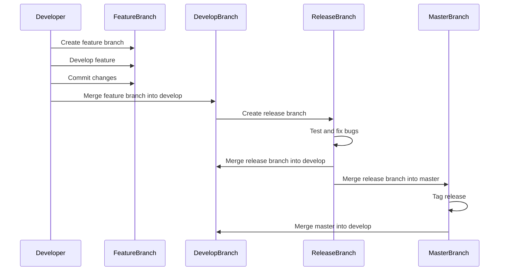

# Git Deep Dive

Git is a distributed version control system that is widely used for source code management. It was created by Linus Torvalds in 2005 to manage the Linux kernel source code. Git is a powerful tool that allows you to track changes to your code, collaborate with others, and manage your codebase effectively.

In this guide, we will explore the core concepts of Git and learn how to use Git effectively in your projects.

## Table of Contents

- [Getting Started with Git](getting-started.md)
- [Working with Repositories](repositories.md)
- [Branching and Merging](branching-and-merging.md)
- [Collaborating with Others](collaboration.md)
- [Advanced Git Topics](advanced-topics.md)
- [Git Best Practices](best-practices.md)
- [References](references.md)

### Gitflow Process//

The Gitflow process is a branching model that helps teams manage their codebase effectively. It defines a set of rules and conventions for how branches should be created, merged, and managed in a Git repository. The Gitflow process is based on the concept of feature branches, develop branches, release branches, and master branches.

