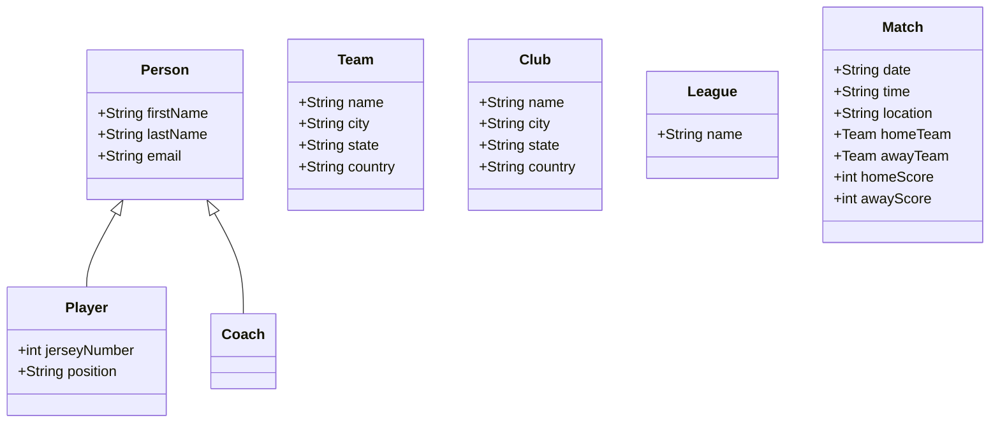
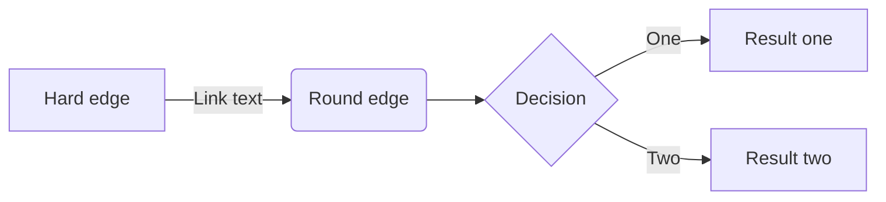

# Mermaid Diagrams

## Class Diagram

```mermaid
classDiagram
    Person <|-- Player
    Person <|-- Coach
    Person : +String firstName
    Person : +String lastName
    Person : +String email
    
    class Player{
        +int jerseyNumber
        +String position
    }
    
    class Team {
        +String name
        +String city
        +String state
        +String country
    }
    
    class Club {
        +String name
        +String city
        +String state
        +String country
    }
    
    class League {
        +String name
    }
    
    class Match {
        +String date
        +String time
        +String location
        +Team homeTeam
        +Team awayTeam
        +int homeScore
        +int awayScore
    }
```

## LR Graph

```mermaid
graph LR
    A[Hard edge] -->|Link text| B(Round edge)
    B --> C{Decision}
    C -->|One| D[Result one]
    C -->|Two| E[Result two]
```
