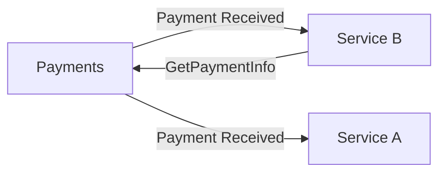
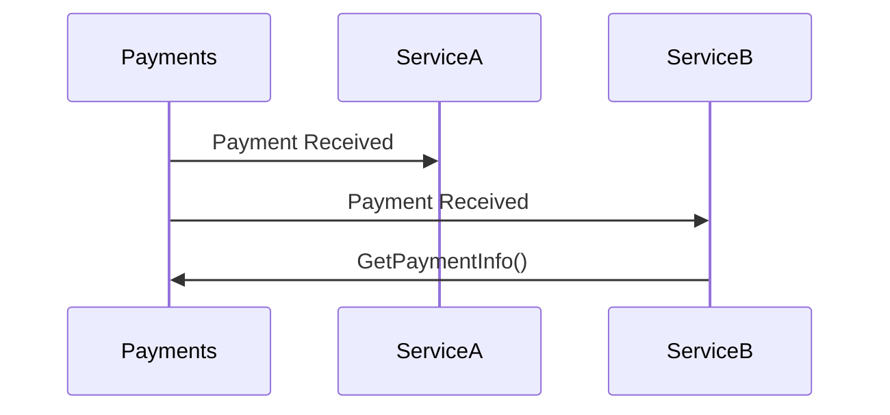

# Event Driven Architecture

## What is Event Driven Architecture?

Event Driven Architecture (EDA):
:   A software architecture paradigm promoting the production, detection, consumption of, and reaction to events.

## What is an Event?

Event:
:   A change in state.

The architecture allows applications to be developed as a highly distributed and loosely coupled organization of components.


Three different uses or patterns exist that can be called EDA individually or altogether:

- Event notifications
- Event-carried state transfer
- Event sourcing

## Event Notifications

Events can be used to notify something has occurred within your application.  A notification event typically carries 
the absolute minimum state, perhaps even just the identifier (ID) of an entity or the exact time of the occurrence 
of their payload.  Components that are notified of these events may take any action they deem necessary.  Events might
be recorded locally for auditing purposes, or the component may make calls back ot the originating component to fetch
additional relevant information about the event.

Payment Received Notification Example



Payment Received Notification Sequence Diagram



## Event-carried state transfer

Event-carried state transfer:
:   An asynchronous cousin to representational state transfer (REST).

- Event-carried state transfer is a push model
- data changes are set out to be consumed by any components that are interested
- components may create their own local cached copies, negating the need to query the originating component to fetch any information to complete their work.

Example:

```Go
type PaymentReceived struct {
    PaymentID   string
    CustomerID  string
    OrderID     string
    Amount      float64
    Date        time.Time
}
```

## Event Sourcing

Instead of capturing changes as irreversible modifications to a single record,
those changes are stored as events.  These changes or streams of events can be
read and processed to recreate the final state of an entity when it is needed again.

When we use event sourcing, we store the events in an event store rather than
communicating them with other services.


## Core Components

Four components are found at the center of all event patterns.

- Event
- Producer
- Consumer
- Event Queue

### Event

At the heart of EDA is the event.  In EDA terms, it is an occurrence that has
happened in the application.  The event itself is in the past and is an immutable
fact.  

In most languages, events are simple value objects that contain state.  An event
is equal to another if all the attributes are the same.  In Go, we would represent
an event with a simple struct, such as PaymentReceived:

```Go
type PaymentReceived struct {
    PaymentID   string
    OrderID     string
    Amount      int
}
```

Events should carry enough data to be useful in capturing the change
in the application state that they're meant to communicate.

The amount of information required to include in an event's payload matters to
all events, the event notification, the event-carried state transfer, and for the 
changes record with event sourcing.

### Queues

Queues are referred to by a variety of terms, including bus, channel, stream, 
topic, and others.  The exact term given to a queue will depend on it's use, 
purpose, and sometimes vendor.  Events are frequently, but not always, organized
in a first-in, first-out (FIFO) fashion we call it simply a Message Queue.

An example generic Queue implementation:

```Go
package main

import (
    "fmt"
)

type Queue[T any] struct {
    items []T
}

// Enqueue adds an element to the end of the queue.
func (q *Queue[T]) Enqueue(item T) {
    q.items = append(q.items, item)
}

// Dequeue removes and returns the element from the front of the queue.
func (q *Queue[T]) Dequeue() T {
    if len(q.items) == 0 {
        return nil // or some appropriate zero value for the type T
    }
    item := q.items[0]
    q.items = q.items[1:]
    return item
}

// IsEmpty returns true if the queue is empty.
func (q *Queue[T]) IsEmpty() bool {
    return len(q.items) == 0
}

func main() {
    q := Queue[int]{} // Specify the type (e.g., int, string, custom struct, etc.)

    // Enqueue some elements
    q.Enqueue(1)
    q.Enqueue(2)
    q.Enqueue(3)

    // Dequeue and print elements
    for !q.IsEmpty() {
        fmt.Println(q.Dequeue())
    }
}
```


When you need retention and the ability to replay events, an event stream
should be used instead of a message queue.

Note: Take a look at Apache Kafka for a good example of an event streaming.

You will likely want to utilize Kafka's docker image to set up examples locally.


The defining characteristic of a `message queue` is its lack of event retention.  All events put into a message queue 
have a limited lifetime.  After the events have been consumed or have expired, they are discarded. 

A message queue is useful for simple publisher/subscriber (pub/sub) scenarios when the subscribers are actively 
running or can retrieve the events quickly enough.


### Event Stores

As the name implies, an event store is an append-only repository for events.
Potentially millions of individual event streams will exist within an event
store.  Event stores provide optimistic concurrency controls to ensure that each
event stream maintains strong consistency.  An event store is typically not used
for message communication.

Event stores are used in conjunction with event sourcing to track changes
to entities.

### Producers

When some state in the application changed, the producer will publish an event 
representing the change into the appropriate queue.  The producer may include 
additional metadata along with the event that is useful for tracking, performance, 
or monitoring.  The producers of the events will publish it without knowing what
the consumers might be listening to.  It is essentially a fire-and-forget operation.

### Consumers

Consumers subscribe to and read events from queues.  Consumers can be organized
into groups to share the load or be individuals reading all events as they are
published.  Consumers reading from streams may choose to read from the beginning
of a stream, read new events from the time they started listening, or use a cursor
to pick up from where they left the stream.


