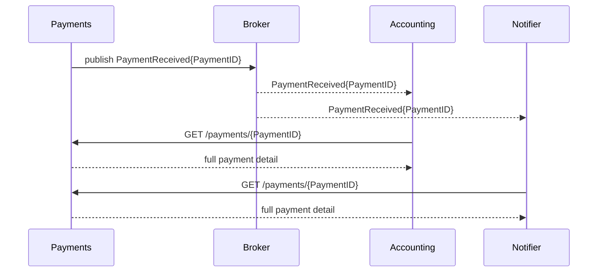
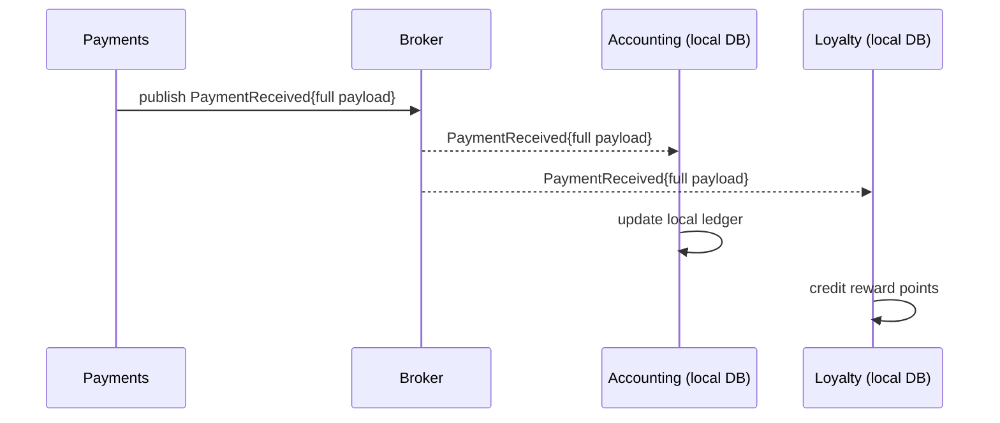
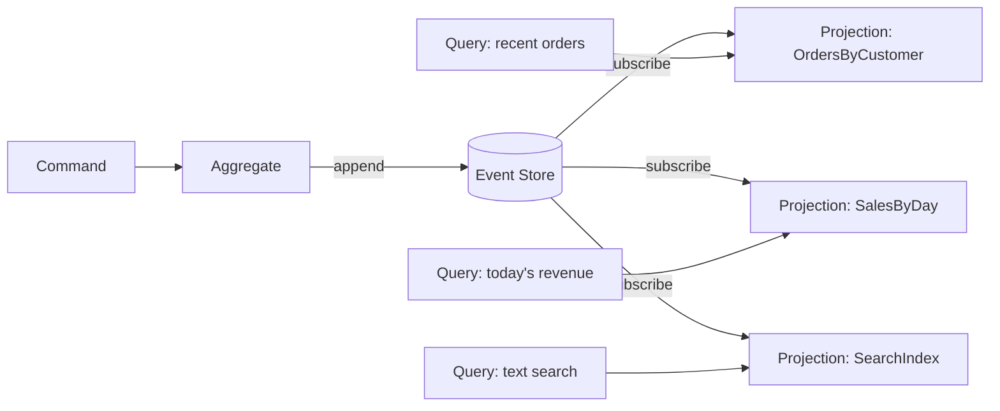
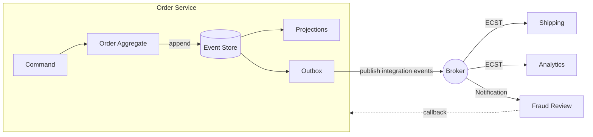

# The three EDA patterns

Event-driven architecture is an umbrella term. Under it sit three distinct patterns that solve different problems and make different trade-offs. Real systems commonly use more than one — often all three — but the patterns are easier to reason about, teach, and evolve when treated as separate ideas.

This doc goes deeper than the summary in the [README](./README.md): what each pattern is *for*, what its events look like, how the flow works, and the specific failure modes each one invites.

---

## Table of contents

- [At a glance](#at-a-glance)
- [Event notification](#event-notification)
- [Event-carried state transfer](#event-carried-state-transfer)
- [Event sourcing](#event-sourcing)
- [Combining patterns](#combining-patterns)
- [Choosing between them](#choosing-between-them)

---

## At a glance

| | **Event notification** | **Event-carried state transfer** | **Event sourcing** |
|---|---|---|---|
| **Primary purpose** | Announce that something happened | Distribute state changes to consumers | Persist the history of an aggregate |
| **Event payload** | Minimal — ID, timestamp, maybe a type | Full — enough to act without a callback | Full — the events *are* the data |
| **Consumer needs to call back?** | Usually yes, to hydrate details | No — event is self-contained | N/A — internal to the owning service |
| **System of record** | The producer's database | The producer's database | The event store itself |
| **Coupling shape** | Runtime read coupling reappears via callback | Loose at runtime; schema coupling remains | Internal to a service; not primarily an integration pattern |
| **Consistency profile** | Producer authoritative; consumers may see stale detail | Eventually consistent across consumers | Strong within an aggregate; eventual across projections |
| **Typical failure mode** | Producer's read API becomes a bottleneck | Payload duplication, schema drift, PII fanout | Schema evolution of historical events, GDPR conflicts |

The three patterns are not mutually exclusive. The distinction is *what the events are for*: **announce** (notification), **integrate** (ECST), **persist** (event sourcing).

---

## Event notification

### Definition

The producer emits a small event whose only job is to signal that a state change occurred. The event carries just enough for a consumer to identify *what* happened and *which* entity it happened to. To act on the change, the consumer typically calls back to the producer (or a shared store) for the details.

### Event shape

```go
type PaymentReceived struct {
    EventID    string    // unique per event, for idempotency
    PaymentID  string    // the aggregate identifier
    OccurredAt time.Time // when the fact became true
}
```

That's it. No amount, no customer, no order. If a consumer needs those, it fetches them.

### Flow



### When to use it

- Most consumers do not need the full detail — only some do
- The full detail is large and would bloat every event
- The full detail is sensitive (PII, financial) and should be fetched over an authenticated read API rather than fanned out on a bus
- The system of record is the producer's database and consumers should always see the freshest version, not a snapshot from event-emission time
- Consumers are external systems where you cannot control payload retention

### Failure modes and anti-patterns

- **Producer becomes a lookup bottleneck.** Every event triggers a callback. Under load, the producer's read API sees N callbacks for every 1 event. Cache aggressively at the producer, and prefer ECST if the callback ratio approaches 1:1 across all consumers.
- **Coupling reappears at the query layer.** You escaped RPC coupling on the write path only to recreate it on the read path. If most consumers must call back, the notification pattern is buying almost nothing over a direct call.
- **Stale reads race the event.** Consumer receives `PaymentReceived`, calls back, and the producer's read replica hasn't seen the row yet. The producer must either serve reads from the primary, wait for replication, or expose a version parameter the consumer can pass.
- **"Notification" that carries too much.** If you find yourself adding fields to the notification because *one* consumer needs them, you are drifting toward ECST — do it deliberately, don't half-do both.

---

## Event-carried state transfer

### Definition

The producer emits an event containing all the state a consumer needs to act. Consumers never call back to the producer. Each consumer maintains its own local copy — a *materialized view* or *read model* — built by processing the events it receives.

Fowler calls this the "asynchronous cousin of REST." REST transfers state on request; ECST transfers state on change.

### Event shape

```go
type PaymentReceived struct {
    EventID     string
    PaymentID   string
    CustomerID  string
    OrderID     string
    AmountCents int64
    Currency    string
    Method      string
    OccurredAt  time.Time
}
```

The event carries everything a downstream service could reasonably need — because there is no callback path.

### Flow



Note the absence of any arrow back to Payments. Accounting and Loyalty can serve their own reads, run their own queries, and remain fully operational if Payments is offline.

### When to use it

- Consumers need to answer questions about the data without depending on the producer being available
- Query patterns on the consumer side differ enough from the producer's that a local model is warranted
- Consumers use different persistence technology (e.g. producer on Postgres, consumer building a search index in Elasticsearch)
- Runtime coupling to the producer is a scaling or reliability problem
- The producer's read load is dominated by consumers hydrating notifications

### Failure modes and anti-patterns

- **Duplicated data across services.** Every consumer that materializes a view is another copy of the truth. Backfills, corrections, and schema changes now have to run everywhere. This is the cost of loose runtime coupling — accept it or don't adopt the pattern.
- **PII fanout.** A payload with a customer name and address, published to a broker with 30-day retention, subscribed to by 12 services, cached by 8 of them — you now have 30-day-retained PII in 20 places. Design payloads with the *least* data every consumer needs, and use notification + authenticated callback for sensitive fields.
- **Schema drift.** The event schema is the integration contract. Every additive change is safe; every rename, removal, or type change breaks consumers. Version explicitly (`v1`, `v2` in the topic, type, or envelope) and run old and new in parallel during migrations.
- **Eventual consistency surprises.** The consumer's view lags the producer's by broker latency plus consumer lag. UIs that read from a consumer view may show stale data seconds after a write. This is inherent, not a bug — surface it in the product design.
- **Rebuild is expensive without replay.** If a consumer's local store is corrupted or a new consumer joins, rebuilding requires replaying every historical event. This is why ECST pairs naturally with event streams (retained, replayable) rather than plain message queues (discarded on ack).

---

## Event sourcing

### Definition

Event sourcing is a *persistence* pattern, not primarily an integration pattern. Instead of storing the current state of an entity, the service stores every state change as an event in an append-only **event store**. The current state of any entity is derived by replaying its event stream from the beginning (or from the most recent snapshot).

The events are the system of record. The "current state" is a projection over them.

### Event shape

Events represent *domain facts*, expressed in the language of the business:

```go
// Not "OrderTableRowUpdated" — express what happened in the domain.
type OrderPlaced struct {
    EventID     string
    OrderID     string
    CustomerID  string
    Items       []LineItem
    OccurredAt  time.Time
    Version     int // monotonic per aggregate; used for optimistic concurrency
}

type OrderItemAdded    struct { EventID, OrderID string; Item LineItem;    Version int }
type OrderItemRemoved  struct { EventID, OrderID string; ItemID string;    Version int }
type OrderShipped      struct { EventID, OrderID string; Carrier, Tracking string; Version int }
type OrderCancelled    struct { EventID, OrderID string; Reason string;    Version int }
```

An `Order` aggregate is reconstructed by loading its stream and applying each event to a starting state:

```go
func LoadOrder(store EventStore, orderID string) (*Order, error) {
    events, err := store.ReadStream(fmt.Sprintf("order-%s", orderID))
    if err != nil {
        return nil, err
    }
    order := &Order{}
    for _, e := range events {
        order.Apply(e)
    }
    return order, nil
}
```

New commands produce new events, which are appended (with an optimistic concurrency check against `Version`) rather than overwriting rows.

### Projections and CQRS

Query patterns rarely match the write model. Event sourcing pairs naturally with **CQRS** (Command Query Responsibility Segregation): commands mutate the aggregate by appending events; queries read from **projections** — materialized read models kept up to date by processing the same events.



Any number of projections can be built, rebuilt, added, or removed at any time by replaying the store.

### Snapshots

Loading a long-lived aggregate by replaying thousands of events is slow. **Snapshots** capture the aggregate's state at a specific version; the loader reads the latest snapshot, then applies only the events after it. Snapshots are an optimization, not part of the event contract — they can be regenerated at any time from the stream.

### When to use it

- The domain requires an audit trail as a first-class feature, not a bolt-on (finance, healthcare, regulated industries)
- Answering "what did we know at time T" is a real business question
- Temporal queries and replay have concrete business value (analytics rebuilds, debugging past state, "what if" scenarios)
- The write model and read models differ enough that CQRS is already the right shape
- Complex domains where the *sequence* of changes carries information the current state alone would lose

### Failure modes and anti-patterns

- **Applied to trivial CRUD.** A four-column table with no reactors and no audit requirement gains nothing from event sourcing and pays a large complexity tax. Reach for it when the domain benefits — not because it is fashionable.
- **Schema evolution of historical events.** You cannot edit history. When an event's structure needs to change, you must either keep the old version and translate on load (upcaster), or run a one-time re-projection with the new schema. Plan for this from day one.
- **GDPR / right-to-be-forgotten.** An append-only, replayable log is at odds with "delete all data about this person." Common mitigations: crypto-shredding (encrypt PII with a per-subject key; delete the key), pseudonymization, and keeping PII out of events by referencing external stores. Design for this before you have subjects to forget.
- **Confusing internal events with integration events.** Domain events in the event store are shaped for the aggregate's needs and evolve with the model. Publishing them raw to other services couples every consumer to your internal model. Translate internal events into stable *integration events* at the service boundary.
- **Snapshot rot.** Snapshot schemas drift from event schemas over time. When they diverge, loading from a stale snapshot then applying newer events yields corrupted state. Version snapshots and invalidate them on incompatible model changes.
- **Projection rebuild time.** Rebuilding a projection from millions of events can take hours. Design projections to be rebuildable in the background while the old projection continues to serve reads.

---

## Combining patterns

Real systems mix the three patterns deliberately:

- A service that **event-sources internally** (its own aggregates persist as events) and publishes **ECST events** at its boundary for other services to consume
- **Notification events** for low-volume, sensitive changes (with a REST callback for detail) alongside **ECST events** for high-volume, non-sensitive changes on the same producer
- **Event sourcing** in the aggregate that owns the write, with **projections** feeding **ECST events** onto a bus for downstream consumers

A common mature shape:



Order Service uses **event sourcing** internally. It emits **ECST events** to Shipping and Analytics that need to react to full state, and a **notification** to Fraud Review, which calls back for a signed detail payload only when it decides to investigate.

---

## Choosing between them

Start from the consumer, not the producer.

1. **Does any consumer need to react to state changes in this producer?**
   - No → you do not need EDA at all.
   - Yes → continue.

2. **Would sending the full state on every change be a problem — size, sensitivity, or freshness requirements?**
   - Yes → **event notification** with an authenticated callback.
   - No → continue.

3. **Do consumers need to serve their own reads independently of the producer's availability?**
   - Yes → **event-carried state transfer**.
   - No → notification may still be enough; ECST is over-engineering if consumers always call back anyway.

4. **Does the producer itself need audit, temporal replay, or CQRS for its own internal model?**
   - Yes → **event sourcing** internally, in addition to whichever integration pattern (notification / ECST) you chose above.
   - No → do not add event sourcing.

Event sourcing is an internal decision, orthogonal to how you *integrate* with other services. Notification and ECST are integration decisions, orthogonal to how you *persist* internally. Treating them as three separate axes — not three items on a menu — makes design conversations much cleaner.
